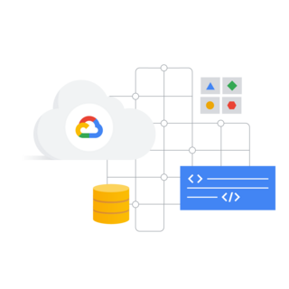

# Google Cloud Fundamentals: Core Infrastructure

Google Cloud Fundamentals: Core Infrastructure introduces important concepts and terminology for working with Google Cloud. Through videos and hands-on labs, this course presents and compares many of Google Cloud's computing and storage services, along with important resource and policy management tools.

## Course Info

### Objectives

- Identify the purpose and value of Google Cloud products and services.
- Interact with Google Cloud services.
- Choose among and use application deployment environments on Google Cloud: App Engine, Google Kubernetes Engine, and Compute Engine.
- Choose among and use Google Cloud's storage options: Cloud Storage, Cloud SQL, Cloud Bigtable, and Firestore.

### Audience

- Individuals planning to deploy applications and create application environments on Google Cloud.
- Systems operations professionals, solution architects getting started with Google Cloud, and developers.
- Executives and business decision-makers evaluating the potential of Google Cloud to address their business needs.

---

## Module 0. Course Introduction

This section welcomes learners to the _Google Cloud Fundamentals: Core Infrastructure_ course and provides an overview of the course structure and goals.

**[Course Introduction PDF](M0%20_%20Course%20Introduction%20v5.2%20_%20ILT.pdf)**

---

## Module 1. Introducing Google Cloud

This section identifies some of the key benefits of using Google Cloud. It introduces the components of the Google network infrastructure and explores the differences between Infrastructure as a Service (IaaS) and Platform as a Service (PaaS).

**[Introducing Google Cloud PDF](M1%20_%20Introducing%20Google%20Cloud%20v5.2%20_%20ILT.pdf)**

---

## Module 2. Resources and Access in the Cloud

This section explores how resources are organized using projects and how access is managed through **Identity and Access Management (IAM)**. It also introduces different ways to interact with Google Cloud.

**[Resources and Access in the Cloud PDF](M2%20_%20Resouces%20and%20Access%20in%20the%20Cloud%20v5.2%20_%20ILT.pdf)**

---

## Module 3. Virtual Machines and Networks in the Cloud

This section explores how **Google Compute Engine** works, with a focus on virtual networking.

**[Virtual Machines and Networks in the Cloud PDF](M3%20_%20Virtual%20Machines%20and%20Networks%20in%20the%20Cloud%20v5.2%20_%20ILT.pdf)**

---

## Module 4. Storage in the Cloud

This section showcases five core **Google Cloud storage products**:

- Cloud Storage
- Cloud Bigtable
- Cloud SQL
- Cloud Spanner
- Firestore

**[Storage in the Cloud PDF](M4%20_%20Storage%20in%20the%20Cloud%20v5.2%20_%20ILT.pdf)**

---

## Module 5. Containers in the Cloud

This section explores **containers** and how they can be managed with **Kubernetes** and **Google Kubernetes Engine**.

**[Containers in the Cloud PDF](M5%20_%20Containers%20in%20the%20Cloud%20v5.2%20_%20ILT.pdf)**

---

## Module 6. Applications in the Cloud

This section focuses on **developing applications in the cloud**, exploring:

- **App Engine**
- **API management tools** (Apigee Edge and Cloud Endpoints)
- **Cloud Run**

**[Applications in the Cloud PDF](M6%20_%20Applications%20in%20the%20Cloud%20v5.2%20_%20ILT.pdf)**

---

## Module 7. Course Summary

This section provides a final overview and summary of the key takeaways from the course.

**[Course Summary PDF](M7%20_%20Course%20Summary%20v5.2%20_%20ILT.pdf)**

---

This course provides a structured approach to learning **Google Cloud**, covering its **core infrastructure, services, security, pricing, and management tools**.
